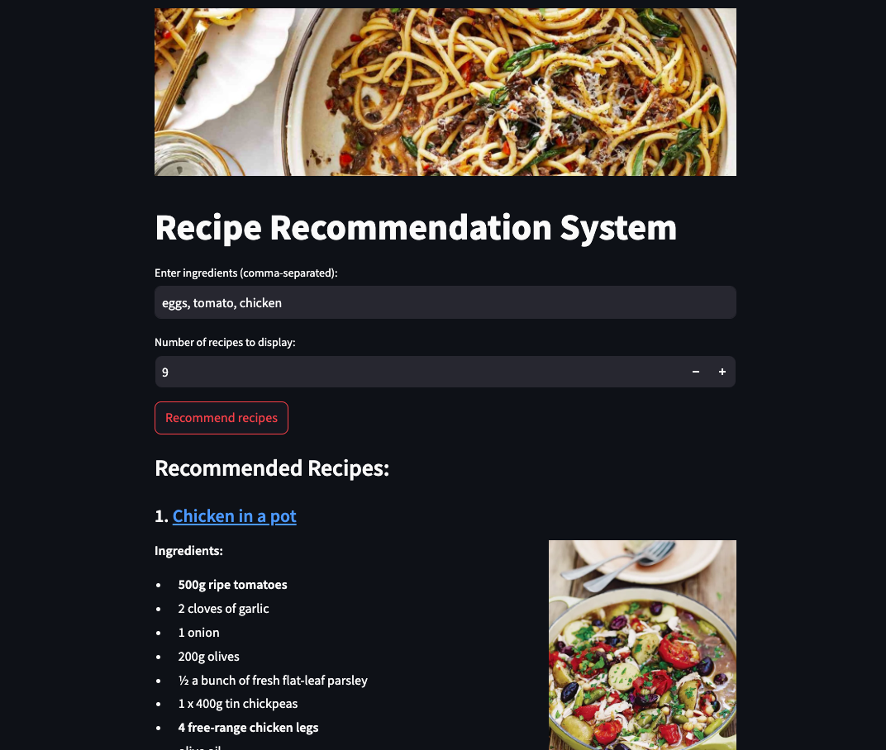

# Recipe Recommendation System

## Project Summary

This project is a recipe recommendation system that provides recipe suggestions based on user-provided ingredients. It employs **web scraping** to gather recipe data, **NLP processing** to process the recipe texts, and a **TF-IDF** and **cosine similarity models** to recommend the most relevant recipes.

**Tools**: BeautifulSoup, Selenium, Scikit-learn (TF-IDF Vectorizer), Pandas, NLTK, Streamlit

https://github.com/user-attachments/assets/55e664f9-1cec-4228-87ae-f891e18ffd0b

**Link**: https://recipe-recommendation-system-joana.streamlit.app/

## Steps

### 1. Web scraping

I began the web scraping process by extracting the links to all the main dish recipes from the [Jamie Oliver website](https://www.jamieoliver.com/recipes/mains/) (totalling 952 recipes), using the `web_scraping_url.py` file.

Once I had the recipe links, I used the `web_scraping_recipe.py` file to extract detailed information from each recipe individually.

For each recipe, I collected:

- Recipe title
- Ingredients
- Recipe URL
- Cooking Time
- Difficulty
- Servings
- Image URL

The scraper worked by parsing the HTML structure of the recipe pages with **Beautiful Soup** and **Selenium**, targeting specific elements to pull out the information I needed.

To ensure I didn’t overwhelm the servers, I added delays between requests and included error handling for any broken links. The scraped data was saved in an excel file for later use.

### 2. NLP Processing

After scraping the data, I processed the ingredients in the `get_ingredient_names.py` file to clean them up and keep only the useful information.

Here’s what I did:

- Converted ingredient names to lowercase;
- Removed content within parentheses;
- Cleaned up extra whitespace;
- Tokenized ingredient strings into words;
- Lemmatized tokens to their base forms;
- Filtered out non-alphabetic tokens, stopwords, measurement units (e.g., "teaspoon", "cup"), and unnecessary words (e.g., "divided", "free");
- Combined filtered tokens into cleaned ingredient strings.

### 3. TF-IDF vectorization and cosine Similarity

Once the ingredient data is cleaned and preprocessed, I used **TF-IDF** (Term Frequency-Inverse Document Frequency) to convert textual data (ingredients) into vectors that represent their importance relative to the whole recipe dataset. This processes is handled in the `tfidf_encoder.py` file.

Each recipe's ingredients are converted into a TF-IDF vector, resulting in a matrix where each row represents a recipe, and each column represents a unique ingredient.

Afterward, the `get_top_recipes.py` file uses Cosine Similarity to compare the input vector with each recipe's vector, generating a similarity score between 0 and 1. A score of 1 means the ingredients match perfectly, while a score closer to 0 means there is little similarity.

Recipes are then sorted based on these similarity scores, with the most relevant ones appearing first. The top N recipes are recommended, and for each recipe, you’ll see details like the name, ingredients, serving size, cooking time, difficulty level, and a link to the full recipe.

### 4. Streamlit

I used Streamlit to deploy the recipe recommendation system as a web application.

In the app, the users enter their the ingredients and the number of recipes they want to see, and the system recommends the most relevant recipes. The app shows detailed information such as the recipe name, a link to the full recipe, ingredients, cooking time, difficulty, and serving size.

